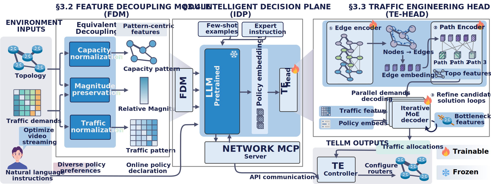

# TELLM


TELLM is a pretrained and generalizable ML-driven TE system. It enables extensible network agents to operate efficiently on traffic engineering (TE) without compromising scalability or optimality.

- [TELLM](#tellm)
  - [📄 Abstract](#-abstract)
  - [🎬 Demos](#-demos)
  - [⚙️ Setup](#️-setup)
  - [🏁 Getting started with TELLM](#-getting-started-with-tellm)
  - [📝 TODO List](#-todo-list)



## 📄 Abstract

  Traffic engineering (TE) systems have widely adopted machine learning (ML)
  techniques to manage volatile, large-scale networks as classic linear
  programming (LP) falls short in scalability. However, current ML-based TE
  introduce significant model engineering and maintenance overhead, requiring
  constant retraining for distribution shifts. TE thus faces an enduring
  trilemma: no existing solution can simultaneously achieve optimality,
  scalability, and generalization.

  Motivated by recent advances in Large Language Models (LLMs), this paper
  tackles one question: _How can LLMs be leveraged to achieve intelligent
    TE that delivers near-optimal solutions at scale while automatically
    adapting to unseen scenarios without retraining?_ To achieve this, we
  present **TELLM**, the first TE system to overcome the trilemma by
  developing agentic LLMs for intelligent traffic optimization. **TELLM**
  decouples TE features into normalized relative representations to adapt across
  environments; design an expressive neural TE handler that enables seamless LLM
  integration while preserving computational efficiency; and resolves the high
  adaptation overhead from policy heterogeneity across environments through an
  LLM-driven control loop that dynamically adjusts strategies without
  retraining. Experiments show unprecedented generalization: our model trained
  on $\leq50$-node networks generalizes
  zero-shot to 700+ node networks with just 1.3\% optimality gap.

## 🎬 Demos
> [!IMPORTANT]
> Its agentic architecture allows seamless switching between backbone LLMs (such as **Claude, GPT, and Qwen**) without overhead, ensuring both flexibility and efficiency in traffic management.
<details open>
<summary>Claude-Sonnet-4</summary>


<!-- > [!NOTE] -->
> A Claude agent dynamically optimizes traffic engineering by actively monitoring network conditions, shifting routing policy from burst-centric headroom reservation to a streaming-optimized approach—reducing congestion and costs while improving maximum link utilization (MLU) and maintaining acceptable sensitivity, with clear reasoning provided for each adaptive decision.

</details>

<details>
<summary>GPT-5</summary>


> A GPT agent continuously optimizes network performance during course selection by addressing both consistent and anomalous traffic burst risks through iterative control-monitoring loops, ensuring alignment with predefined goals and validating outcomes in real-time.

</details>


<details>
<summary>Qwen-2.5-7B</summary>


> A lightweight Qwen2.5-7B agent efficiently optimizes WAN performance using TELLM, leveraging burst-awareness for streamlined, real-time traffic engineering with minimal resource overhead.

</details>


## ⚙️ Setup


Prerequisites
- Python 3.10
- CUDA 12.4 (for GPU support)
- Obtain a [Gurobi](https://www.gurobi.com/) license and setup for gurobipy.

Quick setup for base environment (Anaconda):
```shell
conda env create --file environment.yml
conda activate tellm
```

Install PyTorch:

```shell
pip install torch==2.5.0 torchvision==0.20.0 torchaudio==2.5.0 --index-url https://download.pytorch.org/whl/cu124
```

Install dependencies:

```shell
pip install -r requirements.txt
```

Install acceleration packages:

```shell
pip install flash-attn==2.7.4.post1 --no-build-isolation
pip install deepspeed
```
> [!NOTE]
> See [tellm-mcp-server/README.md](tellm-mcp-server/README.md) for the setup of IDP ([MCP](https://modelcontextprotocol.io/docs/getting-started/intro) based). The file [tellm_demo_abi.py](tellm_demo_abi.py) provides an example implementation for building a TE server in TELLM (Providing APIs for LLMs).

## 🏁 Getting started with TELLM

This repository's core training infrastructure is built on **[PyTorch Lightning](https://pytorch-lightning.readthedocs.io/en/latest/)**, using **[Hydra](https://hydra.cc/docs/intro/)** for modular configuration management. Configs can be found in `configs/`.

- To precompute optimal values via Gurobi for a specific topology named `topo_name` before training, run:

  ```shell
  python gurobi_mlu.py topo=topo_name
  ```

- To pretrain TELLM on multiple environments, we provide example experiment configurations in [experiment](configs/experiment/):
 
  ```shell
  python tellm_main.py experiment=tellm_abggf
  ```

- To convert pretrained checkpoint in  `checkpoint_path` to HuggingFace pretrained models, run:

  ```shell
  python -m tools.save_pretrained --ckpt_path 'checkpoint_path'
  ```

- To align TELLM with diverse TE policies with MoE, run:
 
  ```shell
  python tellm_main.py experiment=policy_align_wmoe pretrained_path='outputs/tellm_pretrained'
  ```

- To test pretrained TELLM in static senarios, modify and run:
  
  ```shell
  python solve_example.py
  ```

## 📝 TODO List

- [x] **Open-source project** – Repository is publicly available with initial codebase
- [x] **Demo Visualization** - Demos with different LLM backbones showing TELLM capabilities
- [ ] **Pretrained Model Release** – Share pretrained checkpoints via HuggingFace Transformers
- [ ] **Data Processing Pipeline** – Prepare and document code for data preprocessing
- [ ] **Dataset Publication** – Release preprocessed datasets
